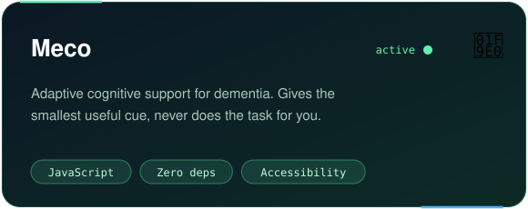
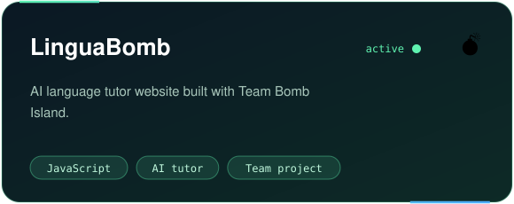
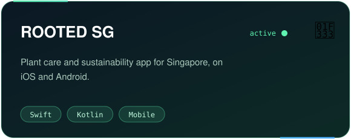
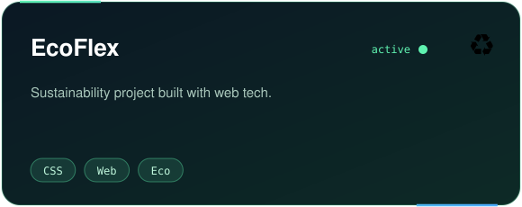
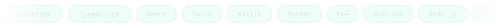

 

## 👋 About me

I'm a student developer in Singapore. Most of my time goes into **robots**, and I do **software** in seasons. The software I care about most helps people: tools for memory, learning and sustainability that stay out of the way.

## 🚧 Currently building

| | Project | What it is |
|---|---|---|
| 🧠 | **Meco** | Cognitive support for dementia that gives the *smallest useful cue* instead of doing the task for you |
| 🌳 | **ROOTED SG** | Plant care and sustainability app, native on iOS and Android |
| 💣 | **LinguaBomb** | AI language tutor, built with Team Bomb Island |
| 🤖 | **Robotics** | Sensors, microcontrollers and BLE hardware (more soon) |

## 🚀 Featured projects

## 🛠️ Toolbox

## 🗺️ Build timeline

Say hi: <a href="https://pranavr.me">pranavr.me</a> · <a href="https://github.com/itzpranav101?tab=repositories">all repositories</a>

